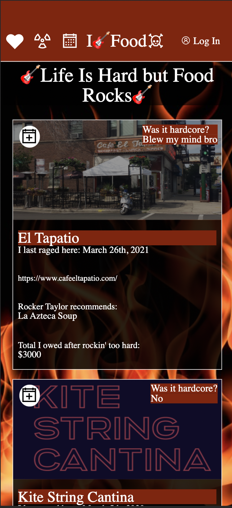

# A Rocker Reviews Food- Static Comp Challenge

Turing 2103 FE Mod 2 Static Comp Challenge

## Table of Contents

- [Introduction](#introduction)
- [Features](#Screenshots)
- [Technologies](#Technologies)
- [Setup](#Setup/execution-Instructions)
- [Future Iterations](#Future)
- [Original Assignment](#Original)
- [Contributors](#Contributors)

## Introduction

This project was a challenge to recreate the layout of a given comp and to make the site responsive across multiple screen sizes. We were able to exercise creative freedom with font, colors, copy, and images. The site did not need to be functional in any way. The purpose of the assignment was to get further practice with HTML and CSS.

## Screenshots
Desktop View

Mobile View

Original Comp

## Technologies
- HTML
- CSS

## Link to Deployed Project
- [Click Here](https://tylrs.github.io/static-comp/)

## Setup/execution-instructions

1. Clone copy of repo to your machine: `git@github.com:tylrs/static-comp.git`
2. CD into the directory
3. Open index.html in your browser
4. Change the width of your browser window to see the responsive design in action!

## Original Assignment

- [Link To Static Comp Project from Turing School of Software and Design](https://frontend.turing.edu/projects/module-1/m1-static-comp)

## Contributors

- [Taylor Galloway](https://github.com/tylrs)
